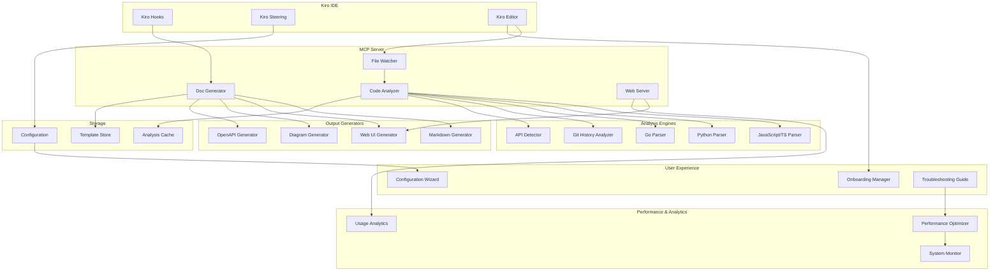

# Design Document

## Overview

The Living Documentation Generator is implemented as an MCP (Model Context Protocol) server that integrates deeply with Kiro's IDE capabilities. The system uses a multi-layered architecture combining real-time file watching, intelligent code analysis, and dynamic documentation generation. The design prioritizes zero-configuration deployment, sub-5-second update performance, and beautiful presentation while showcasing advanced Kiro integration patterns.

The core innovation lies in treating documentation as a living artifact that evolves with code, rather than a static snapshot. This is achieved through continuous analysis, intelligent change detection, and contextual content generation.

## Architecture

### High-Level System Architecture



### MCP Server Architecture

The MCP server follows a plugin-based architecture for extensibility with enhanced user experience components:

```typescript
interface MCPServer {
  analyzers: Map<string, CodeAnalyzer>
  generators: Map<string, DocumentGenerator>
  watchers: FileWatcher[]
  cache: AnalysisCache
  config: ProjectConfig
  performanceOptimizer: PerformanceOptimizer
  onboardingManager: OnboardingManager
  troubleshootingGuide: TroubleshootingGuide
  usageAnalytics: UsageAnalytics
}
```

**Enhanced MCP Tools:**
- `generate_docs` - Core documentation generation
- `watch_project` - Real-time file monitoring
- `stop_watching` - Stop file monitoring
- `detect_project` - Intelligent project detection
- `start_onboarding` - Interactive user onboarding
- `configuration_wizard` - Guided project setup
- `troubleshoot` - Automated diagnostics and issue resolution
- `get_analytics` - Usage metrics and demo insights

## Components and Interfaces

### 1. File Watcher Component

**Purpose:** Monitors file system changes and triggers incremental documentation updates.

**Key Interfaces:**
```typescript
interface FileWatcher {
  watch(patterns: string[]): void
  onFileChanged(callback: (file: FileChange) => void): void
  onFileAdded(callback: (file: string) => void): void
  onFileDeleted(callback: (file: string) => void): void
}

interface FileChange {
  path: string
  type: 'modified' | 'added' | 'deleted' | 'renamed'
  timestamp: number
  content?: string
}
```

**Implementation Strategy:**
- Uses `chokidar` for cross-platform file watching
- Debounces rapid changes (300ms) to avoid excessive processing
- Maintains change queue for batch processing during heavy editing
- Integrates with Kiro's file save hooks for immediate updates

### 2. Code Analysis Engine

**Purpose:** Extracts semantic information from source code across multiple languages.

**Key Interfaces:**
```typescript
interface CodeAnalyzer {
  language: string
  analyze(content: string, filePath: string): AnalysisResult
  extractAPI(content: string): APIDefinition[]
  extractTypes(content: string): TypeDefinition[]
}

interface AnalysisResult {
  functions: FunctionInfo[]
  classes: ClassInfo[]
  interfaces: InterfaceInfo[]
  exports: ExportInfo[]
  imports: ImportInfo[]
  comments: CommentInfo[]
  todos: TodoInfo[]
}
```

**Language-Specific Analyzers:**

- **JavaScript/TypeScript:** Uses TypeScript compiler API for accurate AST parsing
- **Python:** Leverages `ast` module for syntax tree analysis and docstring extraction
- **Go:** Utilizes `go/parser` and `go/ast` packages for comprehensive analysis
- **Generic:** Regex-based fallback for unsupported languages

### 3. Git History Analyzer

**Purpose:** Extracts contextual information from version control history.

**Key Interfaces:**
```typescript
interface GitAnalyzer {
  getFileHistory(filePath: string): CommitInfo[]
  getRecentChanges(since: Date): FileChange[]
  extractFeatureContext(filePath: string): FeatureContext
}

interface CommitInfo {
  hash: string
  message: string
  author: string
  date: Date
  filesChanged: string[]
}
```

**Implementation:**
- Uses `simple-git` library for Git operations
- Analyzes commit messages for feature context
- Tracks file evolution and change patterns
- Identifies breaking changes and deprecations

### 4. Documentation Generator

**Purpose:** Creates beautiful, structured documentation from analysis results.

**Key Interfaces:**
```typescript
interface DocumentGenerator {
  generateMarkdown(analysis: ProjectAnalysis): string
  generateWebUI(analysis: ProjectAnalysis): WebUIAssets
  generateDiagrams(analysis: ProjectAnalysis): DiagramAssets
  applyTemplate(template: Template, data: any): string
}

interface WebUIAssets {
  html: string
  css: string
  javascript: string
  assets: Map<string, Buffer>
}
```

### 5. Web Server Component

**Purpose:** Serves interactive documentation with real-time updates.

**Key Features:**
- Lightweight Express.js server
- WebSocket connections for live updates
- Static asset serving with caching
- Search API with fuzzy matching
- Mobile-responsive design

### 6. Performance Optimization Engine

**Purpose:** Monitors and optimizes system performance for smooth real-time updates.

**Key Interfaces:**
```typescript
interface PerformanceOptimizer {
  optimizeFileChanges(changes: FileChange[]): FileChange[]
  trackAnalysisComplete(filePath: string, duration: number): void
  getMetrics(): PerformanceMetrics
  getOptimizationRecommendations(): string[]
}

interface PerformanceMetrics {
  analysisTime: number
  generationTime: number
  updateLatency: number
  memoryUsage: number
  cacheHitRate: number
  throughput: number
}
```

### 7. User Onboarding System

**Purpose:** Provides guided setup and contextual assistance for new users.

**Key Interfaces:**
```typescript
interface OnboardingManager {
  startOnboarding(): OnboardingProgress
  getCurrentStep(): OnboardingStep | null
  completeCurrentStep(): OnboardingProgress
  getContextualTips(): string[]
  updateProfileFromProject(analysis: ProjectAnalysis): void
}

interface OnboardingStep {
  id: string
  title: string
  description: string
  action?: string
  example?: string
  completed: boolean
  optional: boolean
}
```

### 8. Configuration Wizard

**Purpose:** Interactive setup for complex project configurations.

**Key Interfaces:**
```typescript
interface ConfigurationWizard {
  start(): Promise<void>
  getCurrentStep(): WizardStep | null
  answerCurrentStep(value: any): { valid: boolean; error?: string }
  generateConfiguration(): WizardConfiguration
  saveConfiguration(): Promise<string>
}

interface WizardStep {
  id: string
  title: string
  description: string
  type: 'input' | 'select' | 'multiselect' | 'boolean' | 'path' | 'review'
  required: boolean
  options?: Array<{ value: string; label: string; description?: string }>
}
```

### 9. Troubleshooting and Diagnostics

**Purpose:** Automated issue detection and resolution guidance.

**Key Interfaces:**
```typescript
interface TroubleshootingGuide {
  runDiagnostics(projectPath?: string): Promise<SystemDiagnostics>
  analyzeError(error: Error, context?: any): TroubleshootingIssue[]
  analyzePerformance(metrics: PerformanceMetrics): TroubleshootingIssue[]
  executeAutomatedSolution(issueId: string, solutionId: string): Promise<boolean>
}

interface TroubleshootingIssue {
  id: string
  category: 'performance' | 'configuration' | 'analysis' | 'network' | 'permissions'
  severity: 'low' | 'medium' | 'high' | 'critical'
  title: string
  description: string
  solutions: TroubleshootingSolution[]
}
```

### 10. Usage Analytics and Insights

**Purpose:** Tracks usage patterns and provides demo-ready metrics.

**Key Interfaces:**
```typescript
interface UsageAnalytics {
  trackEvent(type: string, category: string, action: string): void
  trackFeatureUsage(feature: string, details?: Record<string, any>): void
  trackPerformance(metric: string, value: number): void
  getMetrics(): AnalyticsMetrics
  generateDemoInsights(): DemoInsights
  exportData(format: 'json' | 'csv'): string
}

interface DemoInsights {
  keyMetrics: {
    totalDocumentationGenerated: number
    averageGenerationTime: string
    realTimeUpdatesDelivered: number
    searchQueriesProcessed: number
  }
  performanceHighlights: {
    fastestAnalysis: number
    largestProjectProcessed: number
    uptimePercentage: number
  }
}
```

## Data Models

### Project Analysis Model

```typescript
interface ProjectAnalysis {
  metadata: ProjectMetadata
  structure: ProjectStructure
  apis: APIDefinition[]
  types: TypeDefinition[]
  dependencies: DependencyInfo[]
  architecture: ArchitectureInfo
  lastUpdated: Date
}

interface ProjectMetadata {
  name: string
  version: string
  description: string
  languages: string[]
  framework: string
  repository: RepositoryInfo
}

interface ProjectStructure {
  directories: DirectoryInfo[]
  files: FileInfo[]
  entryPoints: string[]
  testFiles: string[]
  configFiles: string[]
}
```

### Documentation Template Model

```typescript
interface Template {
  name: string
  type: 'markdown' | 'html' | 'component'
  content: string
  variables: TemplateVariable[]
  conditions: TemplateCondition[]
}

interface TemplateVariable {
  name: string
  type: 'string' | 'array' | 'object'
  required: boolean
  defaultValue?: any
}
```

## Error Handling

### Graceful Degradation Strategy

1. **Parser Failures:** Fall back to regex-based analysis for unsupported syntax
2. **File Access Errors:** Skip inaccessible files and log warnings
3. **Git Errors:** Continue without history analysis if Git is unavailable
4. **Template Errors:** Use default templates if custom templates fail
5. **Network Errors:** Serve cached documentation if web server fails

### Error Recovery Mechanisms

```typescript
interface ErrorHandler {
  handleParseError(file: string, error: Error): PartialAnalysis
  handleFileError(file: string, error: Error): void
  handleTemplateError(template: string, error: Error): string
  reportError(context: string, error: Error): void
}
```

## Testing Strategy

### Unit Testing Approach

1. **Parser Testing:** Comprehensive test suites for each language analyzer
2. **Template Testing:** Verify template rendering with various data inputs
3. **Integration Testing:** End-to-end documentation generation workflows
4. **Performance Testing:** Benchmark analysis speed with large codebases
5. **Error Testing:** Validate graceful handling of malformed inputs

### Test Data Strategy

- **Sample Projects:** Curated test projects for each supported language
- **Edge Cases:** Malformed code, empty files, binary files
- **Performance Benchmarks:** Projects of varying sizes (10, 100, 1000+ files)
- **Real-World Examples:** Popular open-source projects for validation

### Automated Testing Integration

```typescript
interface TestSuite {
  analyzerTests: AnalyzerTest[]
  generatorTests: GeneratorTest[]
  integrationTests: IntegrationTest[]
  performanceTests: PerformanceTest[]
}
```

## Kiro Integration Patterns

### Steering File Integration

**Custom Documentation Standards:**
```json
{
  "documentation": {
    "style": "google",
    "includePrivate": false,
    "generateDiagrams": true,
    "customTemplates": {
      "api": "templates/api.md",
      "readme": "templates/readme.md"
    },
    "terminology": {
      "user": "customer",
      "admin": "administrator"
    }
  }
}
```

### Hook Integration Points

1. **On File Save:** Trigger incremental documentation update
2. **On Commit:** Generate full documentation refresh
3. **On Branch Switch:** Update documentation context
4. **On PR Creation:** Generate documentation diff

### Contextual Documentation

```typescript
interface KiroContext {
  currentFile: string
  openFiles: string[]
  gitBranch: string
  recentChanges: FileChange[]
  userPreferences: UserPreferences
}
```

## Performance Optimization

### Caching Strategy

1. **Analysis Cache:** Store parsed AST results with file hash keys
2. **Template Cache:** Pre-compile templates for faster rendering
3. **Asset Cache:** Cache generated diagrams and static assets
4. **Incremental Updates:** Only regenerate changed sections

### Memory Management

- **Streaming Processing:** Process large files in chunks
- **Lazy Loading:** Load analysis results on demand
- **Cache Eviction:** LRU cache with configurable size limits
- **Memory Monitoring:** Track and report memory usage

### Scalability Considerations

- **Worker Threads:** Offload heavy analysis to background threads
- **Batch Processing:** Group file changes for efficient processing
- **Progressive Enhancement:** Start with basic docs, enhance over time
- **Resource Limits:** Configurable limits for large projects

## Security Considerations

### Input Validation

- **File Path Sanitization:** Prevent directory traversal attacks
- **Content Filtering:** Sanitize user-generated content in templates
- **Size Limits:** Prevent resource exhaustion from large files
- **Type Validation:** Strict typing for all external inputs

### Access Control

- **File System Permissions:** Respect existing file permissions
- **Network Security:** HTTPS for web server, secure WebSocket connections
- **Configuration Validation:** Validate all configuration inputs
- **Dependency Security:** Regular security audits of dependencies